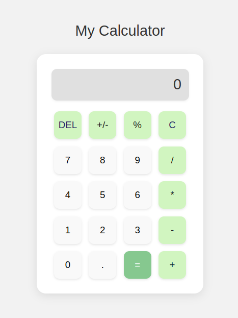

# Calculator



A modern, responsive calculator web application with keyboard support and intuitive UI.

## Features

- **Basic Operations**: Addition, subtraction, multiplication, division
- **Advanced Functions**:
  - Percentage calculations
  - Sign toggle (+/-)
  - Decimal input
- **UI Features**:
  - Visual button feedback
  - Active operator highlighting
  - Responsive design
- **Keyboard Support**: All operations can be performed via keyboard
- **Error Handling**: Division by zero protection, overflow detection

## Technologies

- HTML5
- CSS3 (Flexbox)
- JavaScript (ES6)

## Installation

1. Clone the repository:

   ```bash
   git clone https://github.com/your-username/calculator.git
   ```

2. Open `index.html` in your browser

## Usage

### Mouse/Touch Controls

- Click buttons to input numbers and operations
- `C` - Clear all
- `DEL` - Delete last digit
- `=` - Calculate result

### Keyboard Shortcuts

| Key        | Function    |
| ---------- | ----------- |
| 0-9        | Numbers     |
| + - \* /   | Operators   |
| .          | Decimal     |
| Enter or = | Equals      |
| Escape     | Clear       |
| Backspace  | Delete      |
| p          | Percentage  |
| t          | Toggle sign |

## Project Structure

```
calculator/
├── index.html         # Main HTML file
├── styles.css         # Stylesheet
├── script.js          # Main application logic
└── screenshots/       # Screenshots
    └── calculator.png # Main screenshot
```

## Contributing

Pull requests are welcome. For major changes, please open an issue first to discuss what you would like to change.

## License

[MIT](https://choosealicense.com/licenses/mit/)

```

This format includes:
1. Clear project title with screenshot
2. Feature list with bullet points
3. Technology stack
4. Installation instructions
5. Usage section with both mouse and keyboard controls
6. Project structure
7. Standard open-source sections (Contributing, License)

The formatting uses proper Markdown syntax for:
- Headers
- Code blocks
- Tables
- Lists
- Image embedding

You can copy this directly into your `README.md` file.
```
